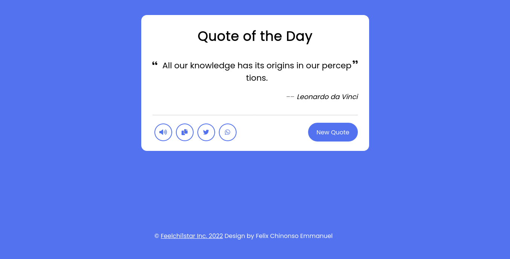
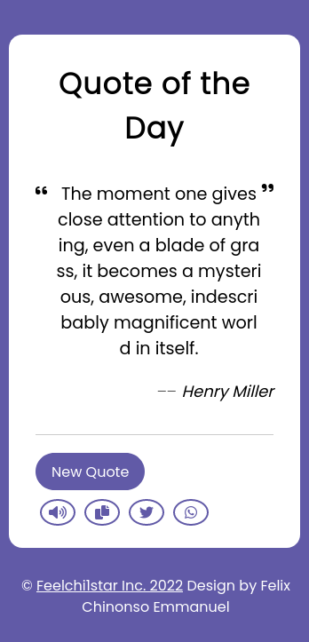

# RandomquoteGenerator

Random Quote Generator using HTML CSS AND JAVASCRIPT with Random quote API. As a beginner in this project you will be learning how to work with API in Vanilla Javascript.

## Table of Contents

- [Overview](#overview)
- [Built With](#built-with)
- [Features](#features)
- [Acknowledgements](#acknowledgements)
- [Contact](#contact)

<!-- OVERVIEW -->

## Overview

## Desktop View



## Mobile View



### Built With

- [HTML](https://html.org/)
- [CSS](https://w3.org/)
- [Javascript](https://javascript.com)

## Features

This application contains some features such as Text-speech API, Share to Whatsapp, twitter and you can also copy quotes to clipboard.

## How To Use

<!-- Example: -->

To clone and run this application, you'll need [Git](https://git-scm.com) and [Node.js](https://nodejs.org/en/download/) (which comes with [npm](http://npmjs.com)) installed on your computer. From your command line:

```bash
# Clone this repository
$ git clone https://github.com/feelchi1star/RandomquoteGenerator.git

# Install dependencies
$ npm install

# Run the app
$ npm start

#Search for Random quote API on github
$ https://api.quotable.io/random
$ fetch("https://api.quotable.io/random")
```

# Acknowledgements

- [Steps to replicate a design with only HTML and CSS](https://devchallenges-blogs.web.app/how-to-replicate-design/)
- [Node.js](https://nodejs.org/)
- [Marked - a markdown parser](https://github.com/chjj/marked)

## Contact

- Website [Feelchi1star.com](https://www.feelchi1star.com)
- GitHub [Feelchi1star](https://github.com/feelchi1star)
- Twitter [@Feelchi1star](https://twitter.com/feelchi1starcom)
